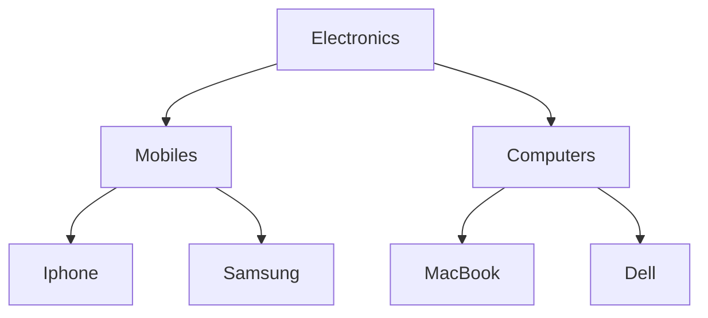

# Hierarchical Category System (Adjacency List)

This project implements a high-performance hierarchical category system using the Adjacency List pattern. It is designed to handle nested categories (Parents > Children) efficiently within a Spring Boot and Hibernate environment.


## Overview
Categories can have a parent category, forming a tree hierarchy:




##  Features

- **Zero N+1 Performance Trap:** Most implementations suffer from the N+1 problem by querying the database for every child. This system fetches the entire dataset in one single, flat $O(1)$ database query.
- **$O(n)$ Tree Construction:** Implements a high-efficiency Flat-to-Tree algorithm in the application layer to assemble the hierarchy.
- **Frontend Friendly:** Produces a clean, recursive JSON structure (Top-Down) ready for Tree-View components.


## Tech Stack
- Java 25
- Spring Boot
- Spring Data JPA
- Hibernate
- Lombok
- MySQL

---


## Database Schema
```sql
CREATE TABLE categories (
    id SERIAL PRIMARY KEY,
    name VARCHAR(255) NOT NULL,
    parent_id BIGINT UNSIGNED NULL,
    CONSTRAINT fk_parent
        FOREIGN KEY (parent_id)
        REFERENCES categories(id)
        ON DELETE CASCADE
);
```

- `parent_id` is a **self-referential foreign key** — points back to the same table
- `ON DELETE CASCADE` — deleting a parent automatically deletes all its children
- `parent_id = NULL` means the category is a root (top-level)


## API Response
```json
[
  {
    "id": 2,
    "name": "Electronics",
    "children": [
      {
        "id": 1,
        "name": "iPhone Pro Max",
        "children": []
      },
      {
        "id": 3,
        "name": "Samsung Galaxy",
        "children": []
      }
    ]
  }
]
```