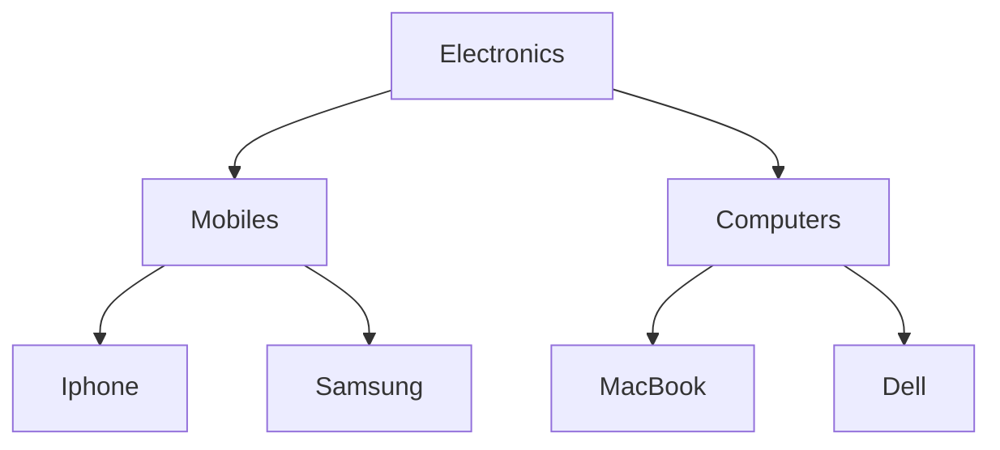

# Hierarchical Category System (Adjacency List)

This project implements a high-performance hierarchical category system using the Adjacency List pattern. It is designed to handle nested categories (Parents > Children) efficiently within a Spring Boot and Hibernate environment.


You can render the tree on the front end using the Depth-First Search traversal algorithm via recursion.

Here is an example: [Mega menu](https://github.com/LovelyFaisal/megamenu/)

## Overview
Categories can have a parent category, forming a tree hierarchy:



##  Features

- **Zero N+1 Performance Trap:** Most implementations suffer from the N+1 problem by querying the database for every child. This system fetches the entire dataset in one single, flat $O(1)$ database query.
- **$O(n)$ Tree Construction:** Implements a high-efficiency Flat-to-Tree algorithm in the application layer to assemble the hierarchy.
- **Frontend Friendly:** Produces a clean, recursive JSON structure (Top-Down) ready for Tree-View components.
- **Display Control**: Take full control of your layout by reordering categories into any sequence you prefer.

## Tech Stack
- Java 25
- Spring Boot
- Spring Data JPA
- Hibernate
- Lombok
- MySQL

---


## Database Schema
```sql
CREATE TABLE IF NOT EXISTS categories (
    id BIGINT NOT NULL AUTO_INCREMENT,
    slug VARCHAR(255) NOT NULL UNIQUE,
    name_ar VARCHAR(255) NOT NULL,
    name_en VARCHAR(255) NOT NULL,
    sort_order INT DEFAULT 0,
    parent_id BIGINT NULL,
    PRIMARY KEY (id),
    FOREIGN KEY (parent_id) REFERENCES categories(id) ON DELETE CASCADE
);
```

- `parent_id` is a **self-referential foreign key** — points back to the same table
- `ON DELETE CASCADE` — deleting a parent automatically deletes all its children
- `parent_id = NULL` means the category is a root (top-level)
- `sort_order = 0` means the order of the category


## API Response
```json
[
  {
    "id": 1,
    "nameAr": "إلكترونيات",
    "nameEn": "Electronics",
    "slug": "electronics",
    "children": [
      {
        "id": 2,
        "nameAr": "جوالات",
        "nameEn": "Mobiles",
        "slug": "mobiles",
        "children": [
          {
            "id": 4,
            "nameAr": "آيفون",
            "nameEn": "iPhone",
            "slug": "iphone",
            "children": []
          },
          {
            "id": 10,
            "nameAr": "ايفون برو ماكس",
            "nameEn": "iphone pro max",
            "slug": "iphonepromax",
            "children": []
          },
          {
            "id": 5,
            "nameAr": "سامسونج",
            "nameEn": "Samsung",
            "slug": "samsung",
            "children": []
          },
          {
            "id": 8,
            "nameAr": "شاومي",
            "nameEn": "Xaomi",
            "slug": "Xaomi",
            "children": []
          }
        ]
      },
      {
        "id": 3,
        "nameAr": "حواسيب",
        "nameEn": "Computers",
        "slug": "computers",
        "children": [
          {
            "id": 6,
            "nameAr": "ماك بوك",
            "nameEn": "MacBook",
            "slug": "macbook",
            "children": []
          },
          {
            "id": 7,
            "nameAr": "ديل",
            "nameEn": "Dell",
            "slug": "dell",
            "children": []
          }
        ]
      }
    ]
  }
]
```